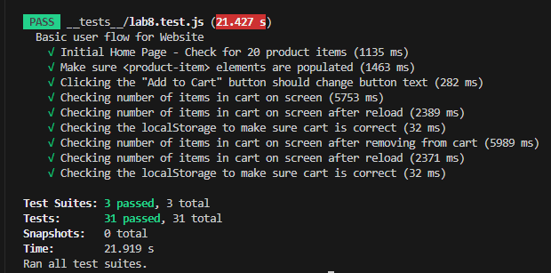

# Lab 8 - Starter
## Christian Sulaiman
### Check your understandings:
1. Within a github action that runs whenever code is pushed. This option is the best choice since it ensures that no matter who contributes to the codebase, testing will be enforced and makes sure that the code passes the tests.
2. No. For cases like these, unit tests are better suited.
3. No because there are many factors in play here such as emojis, including images, etc. and not solely single function so therefore, an End-to-end testing is much better.
4. Yes, I think that a unit test is useful to test this feature since we are ONLY testing a single feature. We can just feed inputs of length > 80 characters and see if the function will return a false or not.

Image of all my tests passing:

